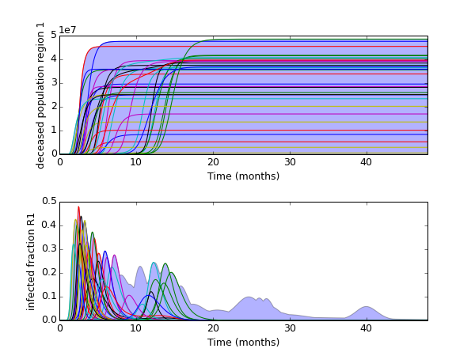

.. meta::
   :description: Simple illustration of using graphs.lines
                 applied to the mexican flu results.
   :keywords: exploratory modeling, robust decision making, deep uncertainty, 
              vensim, python,

.. _advanced-lines:

**************
advanced lines
**************

.. literalinclude:: ./advanced_lines.py