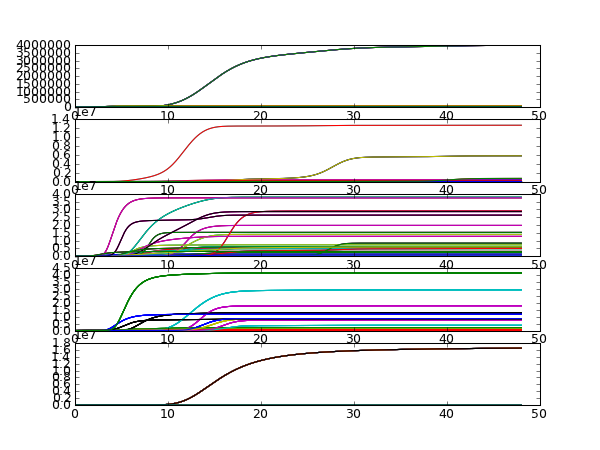

.. meta::
   :description: Simple illustration of using the time series clustering, 
                 applied to the mexican flu data
   :keywords: exploratory modeling, deep uncertainty, vensim, python,
              time series clustering   

.. _Clusterer-illustration:

**********************
Clusterer illustration
**********************

.. literalinclude:: ../cluster_example.py
