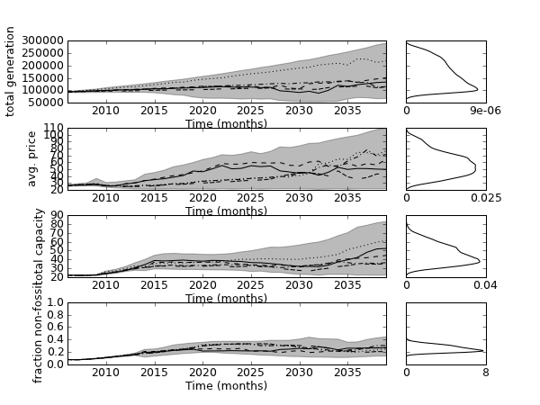

.. meta::
   :description: Exploratory modeling workbench example based on 'An exploratory 
                 analysis of the Dutch Electricity System in Transition', to
                 appear in Journal of the Knowledge Economy.
   :keywords: exploratory modeling, deep uncertainty, energy transition, python,
              agent based modeling, ABM, repast

.. _title: An-exploratory-analysis-of-the-Dutch-Electricity-System-in-Transition

=====================================================================
An exploratory analysis of the Dutch Electricity System in Transition
=====================================================================

**Jan H. Kwakkel and Gonenc Yucell**

This paper is available online at *Journal of the Knowledge Economy*

**Link:** http://link.springer.com/article/10.1007%2Fs13132-012-0128-1

--------
Abstract
--------
Recent contextual developments constitute a backdrop of change for the Dutch 
electricity system. Institutional change driven by liberalization, changing 
economic competitiveness of the dominant fuels, new technologies, and changing 
end-user preferences regarding electricity supply are some examples of these 
developments. This paper explores plausible transition trajectories in the face 
of these developments given technological uncertainty about investment and 
operating costs, and fuel efficiency of various alternative technologies; 
political uncertainty about future CO2 abetment policies such as emission 
trading; and socio-economic uncertainty about fuel prices, investment decisions 
of suppliers, and load curves. Various alternative developments for these 
uncertainties are specified. The consequences of each of these alternative 
developments is assessed using an agent-based model of the Dutch electricity 
system. The outputs are analyzed using various data-mining and data 
visualization techniques in order to reveal arch-typical transition 
trajectories and their conditions for occurring. Policy recommendations are 
derived from this. The results indicate that most transition trajectories point 
towards a future energy supply system that is reliant on clean coal and gas. 
Under the explored uncertainties, only rarely a transition to renewables 
occurs. The various sustainable energy support programs appear to be 
ineffective in steering the energy supply system towards a more sustainable 
mode of functioning across the various uncertainties. 

----------------
About the figure
----------------
The figure shows the envelope of the outcomes of 50.000 experiments and a few 
randomly selected runs for the total generation, total capacity, the average 
price, and the fraction of non-fossil generation. With respect to this last 
indicator, we observe that in none of the runs, this fraction surpasses 0.5. 
That is, in all the runs, in 2100, the sustainable generation will be smaller 
than 50% of all the generated energy. Moreover, we observe that for most of the 
runs, the terminal value for the fraction is around 0.25. If we look at some of 
the individual runs, we observe that there is even a run where the sustainable 
generation rises until around 2025, after which is even declines again In all, 
this paints a rather grim picture for the potential of a transition towards a 
more sustainable energy generation system. 

.. literalinclude:: ../jotke_envelopes.py