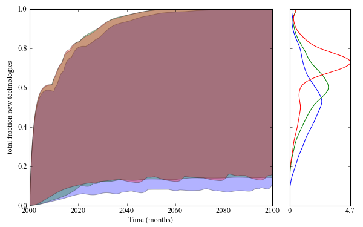

.. meta::
   :description: Exploratory modeling workbench example based on 'Adaptive 
   				Robust Design under Deep Uncertainty'  to appear in 
   				Technological Forecasting and Social Change
   :keywords: exploratory modeling, deep uncertainty, dynamic adaptive policy
              making, vensim, python

.. _Adaptive-Robust-Design-Under-Deep-Uncertainty:

=============================================
Adaptive Robust Design under Deep Uncertainty
=============================================

**Caner Hamarat, Jan Kwakkel, Erik Pruyt**

This paper is available online at *Technological Forecasting & Social Change*

**Link:** http://www.sciencedirect.com/science/article/pii/S004016251200248X

--------
Abstract
--------
Developing strategies, or policies, that automatically adapt to changing 
conditions is called adaptive decision-making, respectively adaptive 
policy-making. In this paper, we propose an iterative computational model-based 
approach to support adaptive decision-making under deep uncertainty. This 
approach combines an adaptive policy-making framework with a computational 
approach to generate and explore thousands of plausible scenarios using 
simulation models, data mining techniques, and robust optimization. The 
proposed approach, which is very useful for Future-Oriented Technology Analysis 
(FTA) studies, is illustrated on a policy-making case related to energy 
transitions. This case demonstrates how the performance of a policy can be 
improved iteratively by exploring its performance across thousands of plausible 
scenarios, identifying problematic subsets that require improvement, 
identifying adaptive high leverage actions with which the adaptive policy needs 
to be extended until a satisfying dynamic adaptive policy is found for the 
entire ensemble of plausible scenarios. The approach is not only appropriate 
for energy transitions; it is also appropriate for any long-term structural and 
systematic transformation characterized by dynamic complexity and deep 
uncertainty.

----------------
About the figure
----------------

In this paper, we propose an iterative model-based approach for designing 
adaptive policies that are robust under deep uncertainty. The approach starts 
from a conceptualization of the decision problem and the identification of the 
key uncertainties. Next, an ensemble of models is developed that explicitly 
allows for the exploration of the uncertainties. The behavior of the ensemble 
is analyzed and troublesome or advantageous (combinations of) uncertainties are 
identified, stimulating policy design. Iteratively, the initial design is 
fine-tuned until there are no remaining troublesome (combinations of) 
uncertainties or the policy is deemed satisfactory based on other grounds. This 
approach thus explicitly uses the multiplicity of plausible futures for policy 
design, addressing one of the shortcomings of many traditional approaches and 
practices, i.e. the poor utilization of the potential to be prepared for 
uncertainties and surprises of future developments. The systemic 
characteristic of the proposed approach enables a holistic and systemic 
exploration of the future, which is of great importance in FTA. 

The proposed approach, Adaptive Robust Design (ARD), is illustrated by means of 
a long-term policy-making case related to the transition of energy system 
toward sustainability. Energy systems are complex, their development over time 
is dynamically complex, and many aspects related to these systems and their 
future developments are deeply uncertain. Current attempts at steering the 
transition toward a more sustainable and cleaner configuration are static and 
may not be very effective and efficient in various futures, i.e. they may not 
be robust. This energy transition case is therefore used for illustrating how 
this approach could be used for policy-making, and more generally, 
decision-making under deep uncertainty.

The initial analysis starts without introducing any policy. As a next step, we 
have analyzed the initial results and designed a basic policy that is focused 
on promoting the decommissioning of the dominant non-renewable technology. 
This initial policy is called basic policy. However, the basic policy was not 
enough to promote transition toward sustainable future. According to the 
analysis on new results, there appeared two opportunities that can be 
benefited. One was related with dominant renewable technology and the other was 
related with economic development and costs. Thus, two adaptive strategies have 
been designed and added on top of the basic policy. Signposts for tracking
specific information have been specified and critical values of signposts, which
are triggers, have been identified in order to trigger the adaptive actions.  
In order to improve the performance of the adaptive strategies even further, 
the triggers are optimized using robust optimization. This new resulting policy 
was called optimized adaptive policy. 

For a sustainable future, the renewable energies should be promoted and there 
should be a transition toward a more sustainable energy system. For this 
reason, we have used the total fraction of the renewable energies over the 
whole energy system as a performance indicator. For each policy, a wide range
of uncertainties were explored and more than 9,000 runs were generated. 
The left side of the figure shows the envelope of the fraction of sustainable 
technologies over a time horizon of 100 years for each policy with a different
color. Envelope can be understood as the upper and lower bounds for the 
fraction over all the runs (>9000). On the right side of the figure, the 
density estimates for the end states of the renewable fraction is shown. Each 
policy is represented with a different color. This method helps us understand 
where the runs are mainly concentrated. 

**Legend: color codes for different policies**

===========  ==============   ============================
 No Policy    Basic Policy     Optimized Adaptive Policy
===========  ==============   ============================
 Blue line    Green line       Red line  
===========  ==============   ============================

----------------------------
Interpretation of the figure
----------------------------

As shown on the right side (gaussian kernel density estimates), there is a 
considerable improvement by introducing the basic policy. The blue line stays 
below the other two policies. It shows that the adaptive policy ensemble, 
although hardly improving the extremes, outperforms the basic policy and 
no policy ensembles on this key performance indicator: the adaptive policy 
is a better guarantee for a successful transition under deep uncertainty, 
without forcing a transition to new technologies upon situations that do not 
require a transition to take place (e.g. in case of a cheap and environmentally
friendly dominant technology) or for which a transition would be overly 
expensive.

-----------
Source Code
-----------

.. literalinclude:: ../policy_comparison.py
